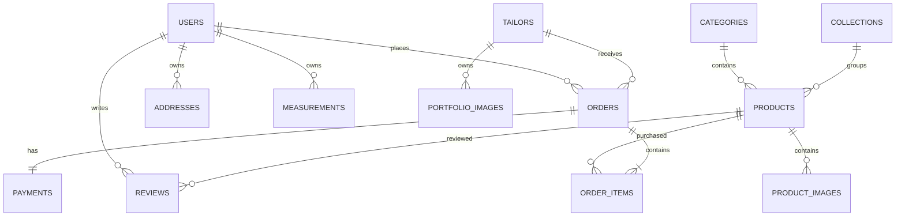

# Database Design

Document ID: ENG-012

Category: Engineering

Version: 1.0

Status: Approved

Owner: Mubeejoy Technologies

Project: Eazi Cut Digital Platform

---

# Purpose

This document defines the logical and physical database design for the Eazi Cut platform.

It includes:

- Database standards
- Tables
- Relationships
- Constraints
- Indexes
- Naming conventions
- Audit fields
- Migration strategy

---

# Database Engine

PostgreSQL 16+

Character Encoding

UTF-8

Timezone

UTC

Naming Convention

snake_case

Primary Keys

UUID

Audit Fields

created_at

updated_at

deleted_at (Soft Delete)

---

# Entity Relationship Diagram

---

# Core Tables

## users

Purpose

Stores customers, tailors, and administrators.

Columns

id UUID PK

first_name

last_name

email

phone

password_hash

role

status

email_verified

profile_image

created_at

updated_at

deleted_at

Indexes

email UNIQUE

role

status

---

## addresses

Stores delivery addresses.

Relationship

Many addresses belong to one user.

Columns

id

user_id FK

country

state

city

street

postal_code

is_default

---

## tailors

Stores tailor-specific information.

Columns

id

user_id FK

shop_name

bio

experience_years

rating

specialization

location

availability

verified

---

## products

Ready-to-wear products.

Columns

id

name

slug

description

price

discount_price

category_id

collection_id

stock

status

featured

---

## product_images

id

product_id

image_url

display_order

---

## categories

id

name

slug

description

---

## collections

id

name

slug

description

banner_image

---

## measurements

Customer body measurements.

Columns

id

user_id

chest

waist

neck

shoulder

sleeve

hip

inseam

height

notes

reference_image

---

## orders

Columns

id

order_number

user_id

tailor_id

status

payment_status

subtotal

shipping_fee

discount

total

delivery_date

notes

created_at

---

Order Status

NEW

ACCEPTED

IN_PROGRESS

QUALITY_CHECK

READY

SHIPPED

DELIVERED

CANCELLED

---

Payment Status

PENDING

PROCESSING

PAID

FAILED

REFUNDED

---

## order_items

id

order_id

product_id

quantity

unit_price

total_price

---

## payments

id

order_id

gateway

transaction_reference

amount

currency

status

paid_at

gateway_response

---

## reviews

id

user_id

product_id

rating

title

comment

created_at

---

## wishlist

id

user_id

product_id

---

## cart

id

user_id

created_at

---

## cart_items

id

cart_id

product_id

quantity

---

## notifications

id

user_id

type

title

message

read

created_at

---

## portfolio_images

Tailor portfolio.

id

tailor_id

image_url

caption

---

## blogs

id

title

slug

content

featured_image

status

published_at

---

## audit_logs

id

user_id

action

entity

entity_id

ip_address

created_at

---

# Relationships

User

↓

Many Orders

↓

Many Order Items

↓

Products

---

Customer

↓

Many Measurements

---

Tailor

↓

Many Orders

---

Products

↓

Many Reviews

---

Collections

↓

Many Products

---

Categories

↓

Many Products

---

# Constraints

Email Unique

Slug Unique

Order Number Unique

Transaction Reference Unique

---

# Indexes

users.email

orders.user_id

orders.tailor_id

orders.status

products.slug

products.category_id

payments.transaction_reference

reviews.product_id

---

# Soft Delete Strategy

Instead of deleting records:

deleted_at = current timestamp

Application filters deleted records automatically.

---

# Audit Fields

Every major table contains:

created_at

updated_at

deleted_at

created_by (future)

updated_by (future)

---

# UUID Strategy

Use UUID for all public entities.

Advantages

Harder to guess

Safer APIs

Better for distributed systems

---

# Database Transactions

Critical operations requiring transactions:

Create Order

Complete Payment

Refund Payment

Inventory Updates

Measurement Creation

---

# Migration Strategy

Use Flyway

Migration Naming

V1__create_users.sql

V2__create_products.sql

V3__create_orders.sql

...

---

# Performance Strategy

Indexes

Pagination

Connection Pooling

Lazy Loading

Query Optimization

---

# Backup Strategy

Daily backups

Point-in-time recovery

Monthly snapshots

---

# Future Tables

appointments

gift_cards

loyalty_points

referrals

corporate_accounts

shipping_providers

inventory_movements

returns

coupons

warehouse

---

# Final Principle

The database should model the business, not the user interface.

Every table must represent a real business concept and support future growth without unnecessary redesign.