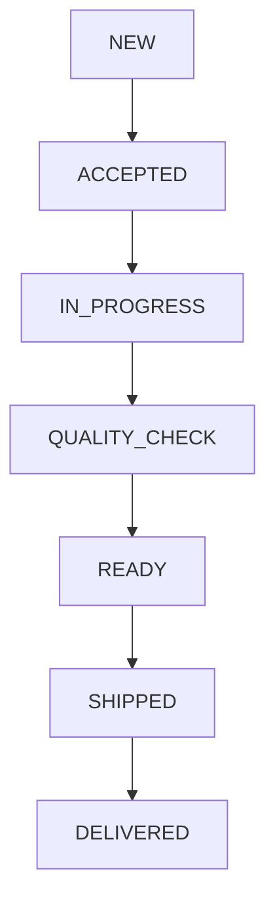

# System Architecture

Document ID: ENG-011

Category: Engineering

Version: 1.0

Status: Approved

Owner: Mubeejoy Technologies

Project: Eazi Cut Digital Platform

---

# Purpose

This document defines the overall technical architecture of the Eazi Cut platform.

It serves as the single source of truth for frontend engineers, backend engineers, DevOps, QA, and AI coding assistants.

---

# Architectural Principles

The system must be:

- Scalable
- Secure
- Maintainable
- Modular
- Performant
- Cloud Ready
- Mobile Ready
- AI Friendly

---

# Architecture Style

The application follows a modern layered architecture.

```mermaid
flowchart LR

Customer

--> Frontend

Frontend

--> REST API

REST API

--> Business Layer

Business Layer

--> Database

Business Layer

--> Payment Gateway

Business Layer

--> Email Service

Business Layer

--> File Storage
```

---

# Technology Stack

## Frontend

Next.js

TypeScript

React

TailwindCSS

Framer Motion

TanStack Query

React Hook Form

Zod

Shadcn UI

---

## Backend

Spring Boot

Java 21

Spring Security

Spring Data JPA

Hibernate

PostgreSQL

Redis (Future)

MapStruct

Lombok

---

## Storage

PostgreSQL

Images

Cloudinary

Future

AWS S3

---

## Authentication

JWT

Refresh Tokens

Role Based Access Control

---

## Payments

Paystack

Future

Flutterwave

Stripe

---

# User Roles

Customer

Tailor

Admin

Super Admin

---

# High-Level Architecture

```mermaid
flowchart TD

Browser

--> Next.js Frontend

Next.js Frontend

--> Spring Boot API

Spring Boot API

--> PostgreSQL

Spring Boot API

--> Cloudinary

Spring Boot API

--> Paystack

Spring Boot API

--> Email Service
```

---

# Application Layers

## Presentation Layer

Next.js

Responsibilities

User Interface

Routing

Forms

Validation

Animations

State Management

---

## API Layer

Spring Boot Controllers

Responsibilities

Receive Requests

Validate Inputs

Return Responses

Error Handling

---

## Business Layer

Services

Responsibilities

Business Rules

Payment Logic

Order Logic

Authentication

Notifications

---

## Data Layer

Repositories

Responsibilities

CRUD

Database Queries

Transactions

---

## Infrastructure Layer

Cloudinary

Paystack

SMTP

Logging

Caching

---

# Domain Modules

Authentication

Customer

Tailor

Products

Collections

Orders

Payments

Measurements

Notifications

Reviews

CMS

Analytics

---

# Request Flow

```mermaid
sequenceDiagram

Customer->>Frontend: Clicks Place Order

Frontend->>API: POST /orders

API->>Order Service

Order Service->>Database

Database-->>Order Service

Order Service-->>API

API-->>Frontend

Frontend->>Customer: Order Created
```

---

# Payment Flow

```mermaid
sequenceDiagram

Customer->>Frontend

Click Pay

Frontend->>Backend

Initialize Payment

Backend->>Paystack

Initialize Transaction

Paystack-->>Backend

Authorization URL

Backend-->>Frontend

Payment URL

Customer->>Paystack

Pays

Paystack->>Backend

Webhook

Backend->>Database

Update Payment

Backend-->>Frontend

Payment Successful
```

---

# Image Upload Flow

```mermaid
flowchart LR

Customer

--> Upload

Upload

--> Backend

Backend

--> Cloudinary

Cloudinary

--> Image URL

Image URL

--> Database
```

---

# Authentication Flow

```mermaid
flowchart LR

Login

--> Validate

Validate

--> JWT

JWT

--> Browser

Browser

--> Protected APIs
```

---

# Order Lifecycle



---

# Security Architecture

JWT Authentication

BCrypt Password Hashing

Role Based Access

HTTPS

Input Validation

Rate Limiting

CSRF Protection

Audit Logging

---

# Folder Structure

Frontend

```
app/
components/
features/
hooks/
lib/
services/
types/
```

Backend

```
controller/
service/
repository/
entity/
dto/
mapper/
config/
security/
exception/
```

---

# External Services

Paystack

Cloudinary

SMTP

Google Maps (Future)

Google Analytics

---

# Error Handling

Global Exception Handler

Standard API Responses

Validation Errors

Logging

---

# Logging Strategy

Application Logs

Authentication Logs

Payment Logs

Error Logs

Audit Logs

---

# Performance Strategy

Lazy Loading

Image Optimization

Caching

Pagination

Compression

Database Indexing

Connection Pooling

---

# Scalability

Stateless Backend

Horizontal Scaling

CDN Ready

Redis Ready

Microservices Ready (Future)

---

# Monitoring

Application Health

Database Health

Payment Health

Email Health

API Metrics

---

# Disaster Recovery

Daily Database Backups

Cloud Image Storage

Rollback Strategy

Version Control

---

# Future Expansion

Mobile Application

Vendor Marketplace

International Payments

Warehouse System

ERP Integration

AI Stylist

---

# Final Principle

Every architectural decision should improve reliability, maintainability, security, and the customer experience.
