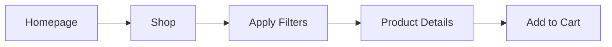
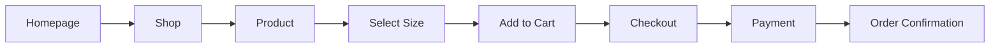
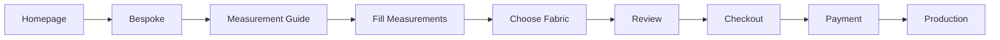
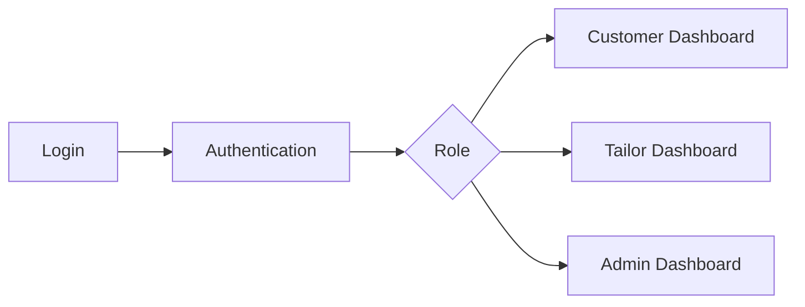
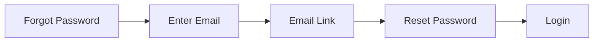
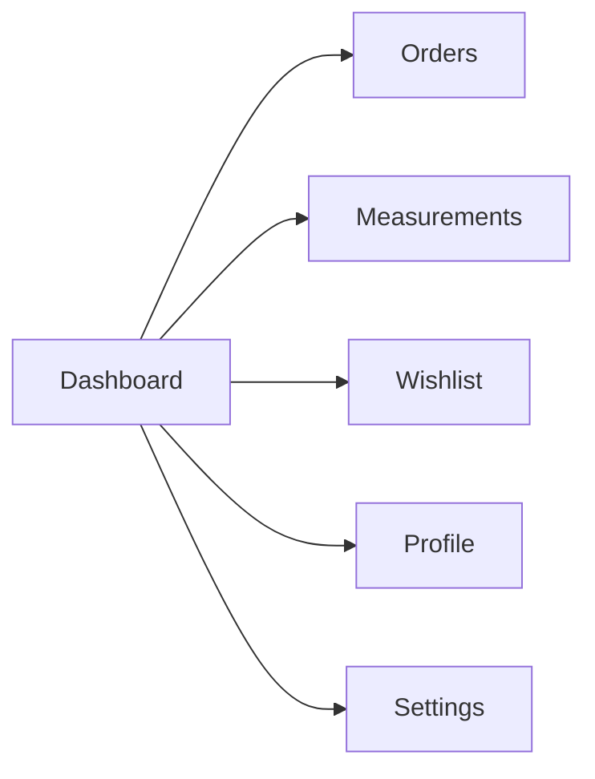
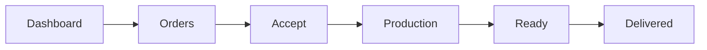
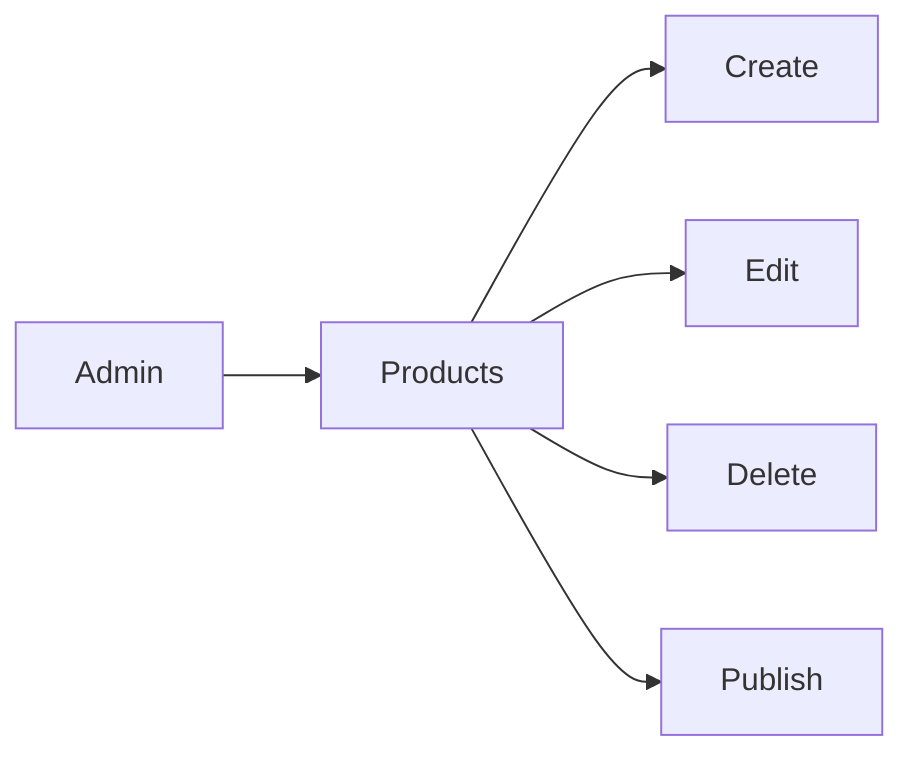
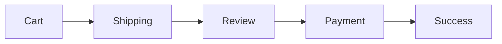
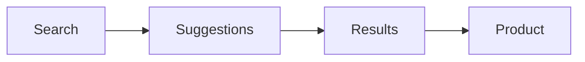

# User Flows

Document ID: PRD-009

Category: Product Design

Version: 1.0

Status: Approved

Owner: Mubeejoy Technologies

Project: Eazi Cut Digital Platform

---

# Purpose

This document defines every important user flow within the Eazi Cut platform.

Every page, API endpoint, validation rule, and interaction should support these flows.

The objective is to minimize friction and create a premium customer experience.

---

# Flow 1 — Browse Products



Goal

Allow customers to quickly discover products.

---

# Flow 2 — Buy Ready-to-Wear Product



Requirements

- Size selection required
- Quantity selection
- Stock validation
- Secure payment
- Confirmation email

---

# Flow 3 — Bespoke Tailoring



Requirements

- Measurements saved
- Images optional
- Fabric selection
- Style selection

---

# Flow 4 — User Registration


Requirements

- Email validation
- Password strength
- Duplicate account check

---

# Flow 5 — Login



---

# Flow 6 — Forgot Password



---

# Flow 7 — Customer Dashboard



---

# Flow 8 — Tailor Dashboard



Order Status

NEW

↓

ACCEPTED

↓

IN_PROGRESS

↓

READY

↓

DELIVERED

---

# Flow 9 — Admin Product Management



---

# Flow 10 — Checkout



Validation

- Stock available
- Address valid
- Payment successful

---

# Flow 11 — Order Tracking

```mermaid
flowchart LR
Order Created
--> Paid
--> In Production
--> Quality Check
--> Shipped
--> Delivered
```

Timeline displayed to customer.

---

# Flow 12 — Product Search



Supports

- Product names
- Categories
- Fabrics
- Collections

---

# Flow 13 — Wishlist

```mermaid
flowchart LR
Product
--> Save
--> Wishlist
--> Move to Cart
```

---

# Flow 14 — Reviews

```mermaid
flowchart LR
Delivered
--> Leave Review
--> Rating
--> Publish
```

Only verified customers may review products.

---

# Flow 15 — Contact Support

```mermaid
flowchart LR
Customer
--> Contact Form
--> Support Team
--> Resolution
```

---

# Error Flows

## Payment Failure


---

## Out of Stock

```mermaid
flowchart LR
Add to Cart
--> Stock Check
--> Out of Stock
--> Notify Customer
```

---

## Session Expired

```mermaid
flowchart LR
Protected Page
--> Session Expired
--> Login
--> Return to Previous Page
```

---

# UX Principles

Every flow should:

- Require the fewest possible steps.
- Provide clear feedback.
- Allow users to recover from errors.
- Never lose user data unexpectedly.
- Maintain a premium, polished experience.

---

# Success Metrics

- Registration completed in under 2 minutes.
- Checkout completed in under 3 minutes.
- Product discoverable within 3 clicks.
- Order status always visible.
- Customers can recover from errors without contacting support.

---

# Final Principle

Every user flow should feel effortless.

Customers should focus on buying great clothing—not figuring out how to use the website.